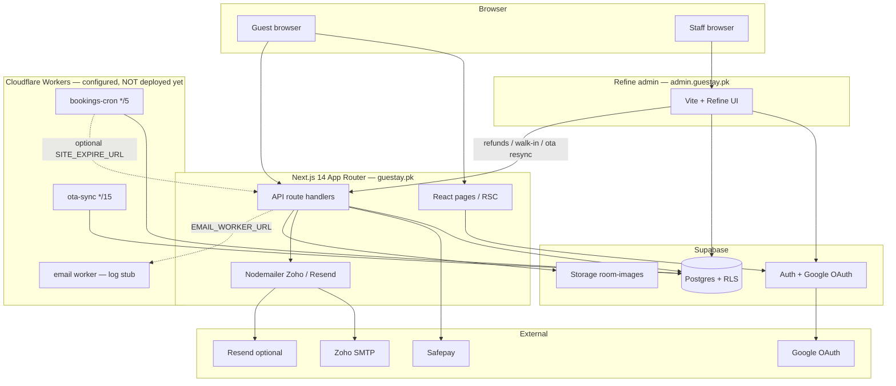
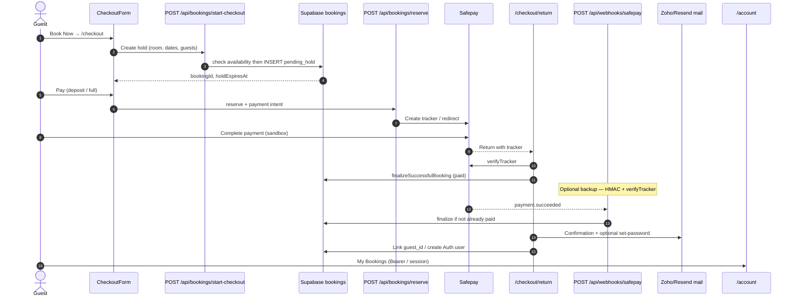
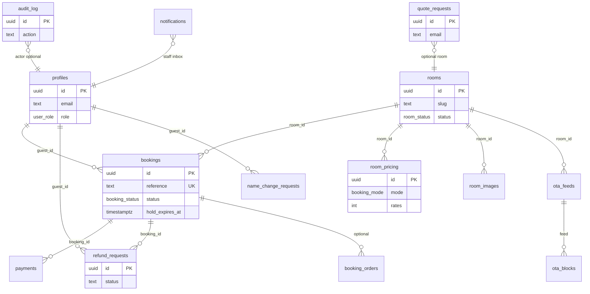

# Guestay — Pre-Production Readiness Audit

**Date:** 2026-08-03  
**Scope:** Read-only investigation of the Guestay monorepo (storefront Next.js app, Refine admin, Supabase schema, Cloudflare Workers).  
**Method:** Code review, migration/RLS analysis, `npm audit`, Wrangler account probe, env-name checks (no secret values recorded).  
**Deliverable:** This file only — nothing was fixed or changed in application code.

**Overall verdict:** The product logic for booking → Safepay sandbox → confirm → account is substantially built, but the project is **not production-ready**. Top blockers are (1) Cloudflare deployment targeting Pages without an OpenNext/Workers SSR adapter, (2) unauthenticated admin mutating APIs, (3) hold overbooking race, and (4) Workers/cron not actually deployed on the Cloudflare account.

---

## 0. Deployment reality check

| Item | Status |
|------|--------|
| Current deploy target as configured in-repo | ❌ **Cloudflare Pages** (`wrangler.toml`: `pages_build_output_dir = ".vercel/output/static"`, project name `guestay-web`) |
| OpenNext / `@opennextjs/cloudflare` adapter | ❌ **Not installed, not configured** — no `open-next.config.*`, no `.open-next` build scripts |
| `@cloudflare/next-on-pages` | ❌ **Not present** in `package.json` |
| Live Workers on Cloudflare account | ❌ **None found** — Wrangler reports `guestay-web`, `guestay-bookings-cron`, `guestay-email`, `guestay-ota-sync` do not exist (API code 10007). Cron triggers exist only in local `wrangler.toml` files. |
| Cloudflare official guidance for full Next.js SSR | 🔍 Workers via **OpenNext** — App Router, Route Handlers, SSR, Middleware, Server Actions are supported on Workers with `@opennextjs/cloudflare`. Pages is positioned primarily for static / assets-oriented deployments; migrating Pages → Workers is the documented path for full-stack apps. |

### Why this is a top-priority finding

Guestay is a full SSR Next.js 14 App Router app with:

- Dozens of **API route handlers** under `src/app/api/**`
- **`force-dynamic`** pages (home, rooms, checkout return, booking confirmed)
- Server-side mail (Nodemailer), Safepay HMAC (`crypto`), service-role Supabase
- No static export (`output: 'export'` is not set)

`wrangler.toml` itself admits the gap:

> Output: use `@cloudflare/next-on-pages` or OpenNext adapter at deploy time.  
> For now this documents the intended Pages project.

Pointing `pages_build_output_dir` at `.vercel/output/static` without an adapter that emits a Node-compatible Worker for App Router SSR means API routes, dynamic SSR, and Node APIs are at risk of running in a **degraded, unsupported, or non-functional** mode on Pages. Cloudflare’s current Next.js guide is Workers + OpenNext, not classic Pages.

**Must-fix before go-live:** migrate the storefront to **Cloudflare Workers + `@opennextjs/cloudflare`**, replace `pages_build_output_dir` with OpenNext’s `main` / `assets` layout, add `preview`/`deploy` scripts, and deploy Workers (web + cron + ota; email only if still needed).

Admin is a separate Vite/Refine SPA (`admin/`) — that *can* sit on Pages or Workers Assets as a static site; the storefront cannot safely follow the same pattern.

---

## 1. Architecture & data flow

### 1.1 System architecture



### 1.2 Checkout sequence



**Note:** In current testing posture, **browser return page is primary finalize**; webhook is an idempotent backup and **returns 503 if `SAFEPAY_WEBHOOK_SECRET` is unset**.

### 1.3 Core entity relationship (simplified)



### 1.4 External service dependency map

| Service | Used for | If down / misconfigured |
|---------|----------|-------------------------|
| **Supabase** (Postgres, Auth, Storage) | Inventory, holds, bookings, RLS, guest/staff login, room images | Storefront cannot create holds/reserve/finalize; rooms may fall back to mock catalog; account linking fails; admin data empty |
| **Safepay** | Card checkout, tracker verify, webhooks | Paid checkout fails (mock gateway only when keys unset); `/checkout/return` cannot confirm paid; webhook path dead |
| **Zoho SMTP** | Booking confirmation, contact form, quote mail | Booking still confirms in DB; emails skipped/warned; contact may 503 |
| **Resend** (optional) | `noreply@` account-setup / Auth SMTP | Set-password / Auth emails degrade; Zoho may be overloaded as fallback |
| **Google OAuth** | Guest/staff Google sign-in | Password / magic-link paths still available if configured; Google button fails |
| **Cloudflare** (edge + Workers) | Intended host for site + cron + OTA | **Today:** no Workers deployed — hold expiry cron and OTA sync are **dormant**; site not confirmed on CF production |
| **Email Worker** (`EMAIL_WORKER_URL`) | Refund decision notify (optional) | Refund emails skip; booking mail does **not** depend on this worker |

### 1.5 Layers between browser and database

Real path for a typical mutating guest API (e.g. start-checkout):

1. **Browser** — `fetch` / form from a client component (`CheckoutForm`)
2. **Next.js App Router route handler** — `src/app/api/.../route.ts` (no `middleware.ts` in repo)
3. **Domain libraries** — e.g. `src/lib/bookings/holds.ts`, `availability.ts`, `confirm.ts`, `payments/gateway.ts`
4. **`createServiceSupabase()`** — `@supabase/supabase-js` with **service role** key (bypasses RLS) and forced `cache: "no-store"` fetch
5. **Supabase PostgREST / Auth Admin HTTP API**
6. **Postgres** — constraints + RPCs (`beds_occupied`, `expire_pending_holds`); RLS applies only when using anon/authenticated clients, **not** service role

Admin Refine path often skips Next entirely:

1. Staff browser → Refine dataProvider → Supabase JS (**anon key + user JWT**) → **RLS enforced** → Postgres  
2. Or Refine → Next `/api/admin/*` → **service role** (RLS bypassed — auth must be in the route; often missing)

---

## 2. Directory & dead code audit

### 2.1 Top-level layout (relevant)

```
Guestay/
  src/                 # Next.js storefront
  admin/               # Vite + Refine staff app
  workers/             # email, bookings-cron, ota-sync
  supabase/migrations/ # schema + RLS
  scripts/             # seed + smoke scripts
  public/              # brand + static images
  wrangler.toml        # Pages-oriented stub for guestay-web
```

### 2.2 Confirmed unused / retired

| Path | Finding | Status |
|------|---------|--------|
| `admin/src/mock/store.ts` | **Already deleted** (commit `22385a4`). `admin/src/mock/` is an empty dir. No references. | ✅ Gone — safe to remove empty folder |
| `src/app/admin/*` | Soft-retired shell: layout points staff to Refine (`NEXT_PUBLIC_ADMIN_URL`). Pages still present: `page`, `rooms`, `calendar`, `analytics`, `walk-in`, `ota`, `audit` | ⚠️ Still routable under `/admin` — delete or hard-redirect when cleaning |
| Orphaned components | `HeroCanvas`, `HeroScene`, `HouseMark`, `HeroFlipCard`, `BookingCta`, `CategoryStrip`, `Testimonials`, `EnquireCard`, `BrandWordmark`, `circular-gallery`, `scroll-split-card`, `Section` (only used by unused strips) | ⚠️ Dead UI |
| `src/lib/mock/rooms-client.ts` | No importers | ⚠️ Dead |
| `/api/bookings/hold` | UI uses `start-checkout` only | 🔍 Likely orphaned route |

### 2.3 Unused / weakly used npm dependencies (root)

| Package | Status |
|---------|--------|
| `ical.js` | ❌ Unused (manual ICS parsing elsewhere) |
| `shadcn` | ❌ CLI packaging only |
| `@base-ui/react` | ❌ Zero imports |
| `@supabase/ssr` | ❌ Unused (`@supabase/supabase-js` only) |
| `tw-animate-css` | ❌ Not imported |
| `three`, `@react-three/fiber`, `@react-three/drei` | ⚠️ Only via unused HeroCanvas stack |
| `gsap`, `@gsap/react`, `framer-motion` | ✅ Used |

### 2.4 `console.log` / `debugger` / TODOs

| Check | Result | Status |
|-------|--------|--------|
| `debugger` in app code | None found | ✅ |
| `console.log` in `src/`, `admin/src/` | None (operational `console.error`/`warn`/`info` remain) | ✅ |
| Workers `console.log` | Intentional stub/ops logging | 🔍 OK for Workers |
| `TODO` / `FIXME` / `HACK` | **None** in `src/`, `admin/src/`, `workers/` | ✅ Empty list |

### 2.5 Commented-out dead blocks

No large commented-out implementations found. Retirement notices in `src/app/admin/layout.tsx` and webhook comments are living documentation, not dead code.

---

## 3. Security

### 3.1 Auth (server-side)

| Item | Status | Notes |
|------|--------|-------|
| Next.js `middleware.ts` auth gate | ❌ Not present | |
| Guest account bookings GET | ⚠️ Partial | Bearer JWT checked; also trusts `x-guestay-email` header (spoof risk) |
| Refund request POST | ⚠️ Partial | Auth optional; unauthenticated caller with `bookingId` can open tickets |
| **`POST /api/admin/refunds/decide`** | ❌ **No real auth** | Soft-checks `x-guestay-role` **only if present**; absent → proceeds with service role. Admin UI even hardcodes `"x-guestay-role": "owner"`. |
| **`POST /api/admin/walk-in`** | ❌ Unauthenticated | Creates paid walk-in via service role |
| **`POST /api/admin/ota/resync`** | ❌ Unauthenticated | Proxies to worker |
| Manager → Owner-only API | ❌ **Rejected only in UI** | Direct `POST /api/admin/refunds/decide` succeeds without JWT. **Code review confirmed** — live Manager login test not run in this pass; server path is open to anyone. |
| Refine owner-only pages | ⚠️ Client `Navigate` + nav filter | Analytics/Users/Audit redirect managers; RLS still lets managers read bookings |

### 3.2 RLS (table-by-table summary)

Legend: too open / too closed flagged.

| Table | Assessment | Status |
|-------|------------|--------|
| `profiles` | SELECT own or staff; UPDATE own **without column guard** → guest/manager can set `role = 'owner'` | ❌ Too open (escalation) |
| `rooms` | Public read active; write Owner | ✅ |
| `room_pricing` / `room_images` (table) | Public read; Owner write | ✅ |
| `bookings` | Guest read own; staff FOR ALL (managers can DELETE); public inserts via **service role APIs** | ⚠️ |
| `payments` | Via booking ownership / staff | ✅ intent |
| `refund_requests` | Guest insert own; Owner UPDATE only | ✅ at RLS; ❌ API bypasses |
| `audit_log` | Owner SELECT only; inserts via service/triggers | ✅ |
| `quote_requests` | Anon+auth INSERT `WITH CHECK (true)` | ❌ Spam-open |
| `name_change_requests` | Own UPDATE while pending — can set `status = 'approved'` | ❌ Too open |
| `notifications` | Staff only | ✅ |
| `ota_*` / `ical_export_tokens` | Staff | ✅ |
| Storage `room-images` | Manager may upload; table write Owner-only | ⚠️ Inconsistent |

### 3.3 Secrets

| Check | Status |
|-------|--------|
| `.env` / `.env.local` gitignored | ✅ `.gitignore` covers `.env`, `.env*.local`; only `.env.example` tracked |
| Service role / Safepay secret under `NEXT_PUBLIC_` | ✅ Not found (service role correctly unprefixed) |
| `NEXT_PUBLIC_SAFEPAY_API_KEY` | 🔍 Intentional public merchant key pattern — confirm Safepay treats it as non-secret |
| Real secrets in git history (tracked files) | ✅ Only placeholders in `.env.example` |
| `createServiceSupabase` fallback to anon key if service role missing | ⚠️ Misconfig hazard |

### 3.4 Safepay webhook HMAC

| Item | Status |
|------|--------|
| Real HMAC-SHA256 + `timingSafeEqual` | ✅ `src/lib/payments/safepay-webhook.ts` |
| Fail closed without secret | ✅ Route returns **503** if `SAFEPAY_WEBHOOK_SECRET` unset |
| Timestamp replay window | ✅ 5 minutes |
| Post-verify `verifyTracker` | ✅ |
| Local `.env.local` webhook secret | ⚠️ EMPTY / unset — webhook path not usable until set |

**Verdict:** HMAC implementation is **not regressed**; production must set the secret and register the webhook URL.

### 3.5 Rate limiting

| Surface | App-level limit | Status |
|---------|-----------------|--------|
| Login / signup / forgot-password | Relies on Supabase Auth only | ⚠️ Partial |
| Refund request | None | ❌ |
| Quote request | None (+ open RLS insert) | ❌ |
| Contact | None | ❌ |
| Hold / checkout APIs | None (inventory DoS / hold spam) | ❌ |

### 3.6 Input validation

Server validation exists but is mostly ad-hoc string presence checks — **no shared Zod/schema layer**. Contact + set-password are strongest; admin walk-in/decide and booking holds are weakest.

| Status | ⚠️ Partial overall |

### 3.7 CORS

| Surface | Status |
|---------|--------|
| Next API routes | No explicit CORS headers (same-origin OK for browser) | 🔍 |
| Email / OTA Workers | No auth secret + no CORS lockdown — open if publicly deployed | ❌ |

### 3.8 Hold race condition

**Verification method:** code review of `src/lib/bookings/holds.ts` + `availability.ts` + migrations (no live concurrency test).

| Mechanism | Present? |
|-----------|----------|
| Check then separate INSERT | Yes |
| Exclusion / GiST overlap constraint | No |
| Advisory lock / `FOR UPDATE` | No |
| Atomic check+insert RPC | No |

**Verdict:** ❌ Two simultaneous requests can both pass `beds_occupied` / availability and both insert `pending_hold` for the same room/dates (or over-capacity shared beds). `updateRoomHoldDates` also skips re-checking availability.

### 3.9 Dependency audit (`npm audit`)

**Root (`guestay`):** 8 vulnerabilities — **6 high, 2 moderate, 0 critical**. Dominated by **Next.js 14.2.35** advisories (DoS, cache poisoning, XSS, SSRF-related) plus nested **postcss**. Fix path suggests `next@16.x` (breaking).

**Admin:** 7 vulnerabilities — **4 high, 3 moderate** (`path-to-regexp` via Refine/antd, `react-router`).

| Status | ❌ High vulns present — plan Next upgrade path compatible with OpenNext |

---

## 4. Performance

### 4.1 Core Web Vitals (LCP / INP / CLS)

| Page | Status |
|------|--------|
| `/`, `/rooms`, `/rooms/[slug]`, `/checkout` | 🔍 **Not measured** — no production/preview URL confirmed on Cloudflare; Workers absent. Local `npm run dev` is not a valid CWV signal. |

**Recommended before go-live:** Lighthouse / CrUX on the OpenNext Workers deploy for those four URLs.

### 4.2 Images

| Item | Status |
|------|--------|
| `next/image` on room cards/galleries | ✅ Common |
| Raw `` in Nav/Footer/Hero/contact | ⚠️ Present (some eslint-disabled) |
| Remote patterns (Supabase + Unsplash) | ✅ `next.config.mjs` |
| Alt text | ⚠️ Mixed — rooms good; many decorative `alt=""` |

### 4.3 Bundle / RSC

| Item | Status |
|------|--------|
| Three.js stack | ⚠️ Still in deps; live Hero does not mount it — dead weight if shipped |
| Checkout / account as client components | 🔍 Justified for interactivity |
| Unusually large forced client pages | ⚠️ `request-quote`, auth pages fully client |

### 4.4 Caching balance

| Layer | Behavior | Status |
|-------|----------|--------|
| Room / booking **data** | `force-dynamic` on home/rooms/detail; Supabase client forces `cache: "no-store"` (intentional fix for stale storefront) | ✅ Dynamic data not cached |
| Safepay token | `Cache-Control: no-store` | ✅ |
| Static assets (JS/CSS/fonts/images under `/_next/static`, `public/`) | No custom `_headers` disabling CDN cache; Next default hashed assets remain cacheable when hosted correctly | ✅ Intent preserved **if** deployed on a proper Next host |
| Google Fonts CSS from `fonts.googleapis.com` | Runtime link tags (not `next/font`) | ⚠️ Extra latency; not a “disabled static cache” issue |

**Verdict:** Stale-data fix did **not** obviously disable static asset CDN caching in config. Risk is deployment platform (Pages-without-adapter), not over-aggressive `no-store` on `/_next/static`.

---

## 5. SEO & metadata

| Item | Status | Notes |
|------|--------|-------|
| Unique titles | ⚠️ Partial | Rooms use `generateMetadata`; home relies on root defaults; several client pages inherit only |
| Unique descriptions | ⚠️ Partial | Room taglines yes; many pages share/inherit |
| Open Graph | ⚠️ Site-level only in `layout.tsx` | No per-room OG |
| Twitter cards | ❌ Missing | |
| `sitemap.xml` | ❌ Missing | No `sitemap.ts` / public file |
| `robots.txt` | ❌ Missing | Should allow public; disallow `/admin`, `/checkout`, `/account` |
| Canonical URLs | ❌ Missing | `metadataBase` set to `https://guestay.pk` only |
| Schema.org LodgingBusiness | ❌ Missing | |
| Favicon / app icons | ✅ | `favicon.ico`, `icon.png`, `apple-icon.png`, `public/brand/*` |
| Image alt | ⚠️ Partial | See §4.2 |

---

## 6. Reliability & error handling

| Item | Status | Notes |
|------|--------|-------|
| Storefront 404 | ✅ | `src/app/not-found.tsx` |
| Admin 404 | ❌ | No catch-all in Refine `App.tsx` |
| `error.tsx` / `global-error.tsx` | ❌ Missing | No custom 500 boundary — Next default |
| Supabase unreachable | ⚠️ Partial | Guards/`503` on many APIs; holds fail hard; rooms may mock |
| Safepay unreachable | ⚠️ Partial | UI can show unavailable; paid path fails clearly |
| Zoho unreachable | ⚠️ Partial | Booking still confirms; mail warns |
| Error monitoring (Sentry etc.) | ❌ None | Production errors → `console.*` only — **nobody is alerted** |

---

## 7. Legal & compliance

| Item | Status | Notes |
|------|--------|-------|
| Terms / Privacy / Cancellation content | ⚠️ Placeholder | All three pages include an explicit **“Lawyer review required”** banner and labeled pre-go-live copy (`src/app/terms|privacy|cancellation/page.tsx`) |
| Footer links | ✅ | Routes exist and match Footer |
| Checkout a11y | ⚠️ Partial | Real `<label>` wrapping on guest fields & ToS; payment method tiles lack radiogroup semantics; keyboard works on native controls |

---

## 8. Data integrity & business logic re-verification

| Item | Status | Notes |
|------|--------|-------|
| Hold-expiry Cron scheduled in config | ✅ `workers/bookings-cron/wrangler.toml` → `*/5 * * * *` | |
| Cron **actually running in Cloudflare** | ❌ Worker **not deployed** on account | Configured ≠ running |
| Mirror API `/api/cron/expire-holds` | ⚠️ Exists; `CRON_SECRET` missing locally → open if exposed | |
| Refund → notify → audit | ⚠️ Partial | Request creates `notifications`; decide writes `audit_log`; guest email via EMAIL_WORKER is **log stub**; no Safepay auto-refund (intentional manual) |
| OTA Sync honesty | ✅ | Refine `OtaPage` / legacy admin / dashboard: “OTA sync not yet connected” when empty — no fake live feeds |
| Manager hitting Owner API | ❌ Open | See §3.1 — server does not reject |

---

## 9. Testing coverage

| Item | Status |
|------|--------|
| Automated E2E (Playwright/Cypress) for book→pay→email→account→admin→refund | ❌ **None found** |
| Unit/integration test suite | ❌ No `*.test.*` / `*.spec.*` app tests found |
| Smoke scripts | 🔍 `scripts/smoke-phase2a-apis.ts`, `smoke-booking-sot.ts` exist — manual/ops, not CI E2E |
| Fresh manual E2E in this audit | 🔍 **Not re-executed end-to-end** in this pass (audit-only; Safepay sandbox + live email would need interactive run). Prior product work implies the path exists in code. |

**Recommendation:** Add Playwright (or similar) covering search → book → sandbox pay → confirmation → account bookings → admin visibility → refund request → decide → status — strong portfolio + regression safety.

---

## 10. Production environment checklist

### 10.1 Domain / DNS / SSL

| Item | Status |
|------|--------|
| `metadataBase` / brand assume `https://guestay.pk` | 🔍 Code assumes it |
| Live DNS/SSL verification via Cloudflare API | 🔍 Incomplete — API token lacked Pages project permissions; no Workers deployed under expected names |

### 10.2 Required env vars (local `.env.local` name-check; production CF must mirror)

| Variable | Local status | Production need |
|----------|--------------|-----------------|
| `NEXT_PUBLIC_SUPABASE_URL` / `ANON_KEY` | SET | Required |
| `SUPABASE_SERVICE_ROLE_KEY` | SET | Required |
| `SAFEPAY_API_KEY` / `SECRET_KEY` / `ENV` | SET (sandbox) | Required; flip ENV at go-live |
| `SAFEPAY_WEBHOOK_SECRET` | **EMPTY** | Required for webhook backup |
| `ZOHO_SMTP_*` | SET | Required for booking/contact mail |
| `INTERNAL_NOTIFICATION_EMAIL` | SET | Required ops alert |
| `CRON_SECRET` | **MISSING** | Required once cron hits site API |
| `EMAIL_WORKER_URL` | EMPTY | Optional until email worker real |
| `NEXT_PUBLIC_SITE_URL` | SET | Must be `https://guestay.pk` in prod |
| `NEXT_PUBLIC_ADMIN_URL` | (check) | Must be admin origin |
| `OWNER_BOOTSTRAP_EMAIL` | SET | Ops |
| `RESEND_API_KEY` | SET | Auth/noreply path |
| Google OAuth in Supabase dashboard | 🔍 Dashboard config — not verifiable from repo | Required if Google login offered |

### 10.3 Preview vs production env separation

| Item | Status |
|------|--------|
| Wrangler environments (`[env.preview]` / Workers Builds separate vars) | ❌ **Not configured** in repo |
| Risk | Cloudflare preview builds **default to sharing production env vars** unless explicitly separated — preview could hit prod Supabase/Safepay |

### 10.4 Safepay sandbox → production delta (document only)

When flipping (intentionally not done yet):

1. Set `SAFEPAY_ENV=production`
2. Replace `SAFEPAY_API_KEY`, `NEXT_PUBLIC_SAFEPAY_API_KEY`, `SAFEPAY_SECRET_KEY` with production merchant credentials
3. Register production webhook URL → set `SAFEPAY_WEBHOOK_SECRET`
4. Confirm API hosts (defaults already branch on env in code)
5. Re-test full checkout + refund manual process in Safepay dashboard
6. Update any Safepay dashboard allowlisted return URLs to `https://guestay.pk/checkout/return`

### 10.5 Rollback plan

| Item | Status |
|------|--------|
| Cloudflare deployment history / instant rollback | 🔍 Available on Workers/Pages **once deployed** — not usable today (nothing deployed under expected names) |
| DB migrations rollback | ⚠️ Forward-only SQL in `supabase/migrations` — no documented down migrations |
| Recommended | Deploy via Workers with versioned deployments; keep previous Worker version pinned for one-click rollback; never rely solely on git revert after bad migration |

---

## Prioritized action list

### Must fix before going live

1. **Migrate storefront to Cloudflare Workers + `@opennextjs/cloudflare`** — stop treating this as a static Pages output; API/SSR/middleware will not be first-class on the current Pages stub.
2. **Authenticate all `/api/admin/*` mutating routes** with real Supabase JWT + `profiles.role` checks (especially `refunds/decide`, `walk-in`, `ota/resync`). Do not trust `x-guestay-role`.
3. **Close hold race** — atomic DB constraint or single RPC that checks capacity and inserts under a lock; re-check on hold date updates.
4. **Fix RLS privilege escalation** — prevent self-UPDATE of `profiles.role`; lock down `name_change_requests` status updates; rate-limit / tighten `quote_requests` anon insert.
5. **Deploy and verify `guestay-bookings-cron`** (and set `CRON_SECRET` / Supabase secrets) so holds actually expire in production.
6. **Set production secrets:** `SAFEPAY_WEBHOOK_SECRET`, production site URLs, separated preview vs prod env vars.
7. **Lawyer-reviewed** Terms, Privacy, Cancellation (replace placeholder banners).
8. **Address Next.js high-severity `npm audit` findings** on a version compatible with OpenNext before exposing the app publicly.

### Should fix soon but not blocking launch engineering

1. App-level rate limiting on contact, quotes, refunds, holds, auth-adjacent endpoints.
2. Custom `error.tsx` / admin 404; add Sentry (or similar) so production failures are visible.
3. SEO pack: `sitemap.ts`, `robots.ts`, canonicals, Twitter cards, per-room OG, LodgingBusiness JSON-LD.
4. Delete retired `src/app/admin/*`, empty `admin/src/mock/`, unused components, and dead npm deps (three.js stack, `ical.js`, etc.).
5. Harden `/api/ical` token model; remove email-header trust on account bookings.
6. Make email Worker real **or** remove `EMAIL_WORKER_URL` path and send refund mail via Nodemailer like bookings.
7. Confirm Google OAuth + Auth URL allowlist for `https://guestay.pk/auth/callback`.

### Nice-to-have / portfolio polish

1. Playwright E2E for the critical booking path (excellent portfolio artifact).
2. Core Web Vitals pass on Workers preview with Lighthouse CI.
3. Admin catch-all 404; richer a11y on checkout payment method group.
4. `next/font` or self-hosted fonts instead of runtime Google CSS.
5. Audit log entry on refund **request** create (not only decide).
6. Documented Cloudflare rollback runbook + staging project with isolated Supabase/Safepay sandbox.

---

*End of audit. No application code was modified except creation of this report file.*
