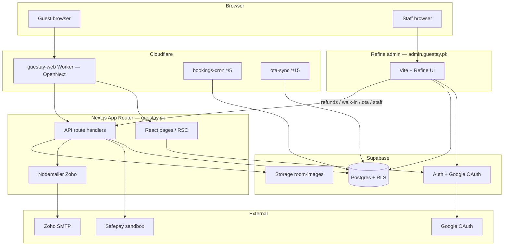
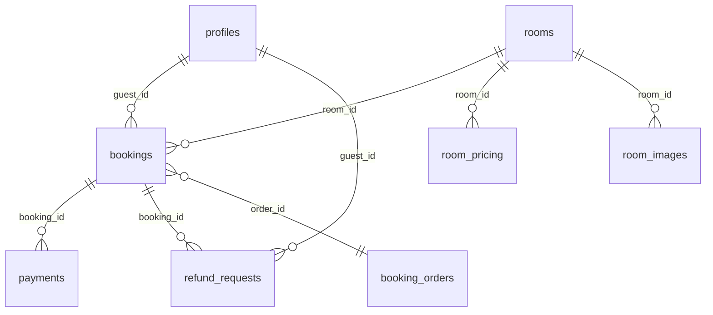

# Guestay

Guestay is a direct-booking product for a Lahore coliving house — guests search availability, hold a room, pay via Safepay, and manage stays in My Account; staff run the house from a separate Refine admin (bookings, refunds, walk-ins, OTA sync). Tagline: *Shared Spaces, Better Living.*

## Tech stack

| Layer | Choice |
|-------|--------|
| Storefront | Next.js 15 (App Router) + TypeScript + Tailwind CSS |
| Motion / UI | Framer Motion, GSAP, Lucide |
| Admin | Vite + Refine (`admin/`) at `admin.guestay.pk` |
| Data / Auth | Supabase (Postgres + RLS + Google OAuth) |
| Payments | Safepay (sandbox today) |
| Email | Nodemailer → Zoho SMTP (`bookings@`); optional Resend for noreply |
| Hosting | Cloudflare Workers via `@opennextjs/cloudflare` (storefront); Workers Assets / Pages-style static for admin |
| Background | Cloudflare Workers: `guestay-bookings-cron`, `guestay-ota-sync` |

## Local setup

```bash
cp .env.example .env.local   # or Copy-Item on Windows
npm install
npm run dev                  # storefront → http://localhost:3000
npm run dev:admin            # admin → http://localhost:3001
```

**Env (names only — see `.env.example`):**

- Public site / admin URLs (`NEXT_PUBLIC_SITE_URL`, `NEXT_PUBLIC_ADMIN_URL`)
- Supabase URL, anon key, service role key
- Safepay sandbox API key + secret + webhook secret
- Zoho SMTP host/user/pass (booking + refund mail)
- Optional: Resend, Sentry, Cloudflare account token for deploys

Apply schema with the SQL under `supabase/migrations/` (then seed if needed). Without live keys, some flows degrade; booking SoT and e2e expect real Supabase + Safepay sandbox.

### Playwright (critical path)

```bash
npx playwright install chromium   # once
npm run seed:e2e-guest            # if the e2e guest user is missing
npm run test:e2e                  # starts Next, runs e2e/critical-path.spec.ts
```

Against a deployed URL, set `PLAYWRIGHT_BASE_URL` (and matching admin/credentials) the same way local does via `.env.local`.

## Architecture

### System



### Checkout sequence

```mermaid
sequenceDiagram
  autonumber
  actor Guest
  participant UI as CheckoutForm
  participant SC as POST /api/bookings/start-checkout
  participant DB as Supabase bookings
  participant Res as POST /api/bookings/reserve
  participant SP as Safepay
  participant Ret as /checkout/return
  participant WH as POST /api/webhooks/safepay
  participant Mail as Zoho mail
  participant Acc as /account

  Guest->>UI: Book Now → /checkout
  UI->>SC: Create hold (room, dates, guests)
  SC->>DB: availability check + INSERT pending_hold
  DB-->>UI: bookingId, holdExpiresAt
  Guest->>UI: Pay (deposit / full)
  UI->>Res: reserve + payment intent
  Res->>SP: Create tracker / redirect
  Guest->>SP: Complete payment (sandbox)
  SP-->>WH: payment.succeeded (HMAC)
  WH->>DB: finalizeSuccessfulBooking (paid)
  Note over Ret: Return stamps tracker; webhook is source of truth for paid
  Ret->>Mail: Confirmation + optional set-password
  Guest->>Acc: My Bookings
```

### Core entities (simplified)



### Deployment

- **Storefront:** `npm run deploy` / `deploy:production` builds with OpenNext and deploys the Worker (`wrangler.toml` → `main = ".open-next/worker.js"`, assets from `.open-next/assets`). Custom domains: `guestay.pk` / `www.guestay.pk`.
- **Admin:** separate package — `npm run deploy:admin` → `admin.guestay.pk`.
- **Cron / OTA:** `workers/bookings-cron`, `workers/ota-sync` (deployed). There is **no** email Worker; all transactional mail goes through the Next.js Zoho path.

## Current status

| Area | State |
|------|--------|
| Direct booking → Safepay → account | Live on `guestay.pk` (Workers + OpenNext) |
| Admin CRM (Refine) | Live on `admin.guestay.pk` |
| Safepay | **Sandbox** — production keys / live mode still deferred |
| Hold expiry + OTA iCal sync | Workers deployed |
| Refund decision emails | Zoho/Nodemailer (same path as booking confirmations) |
| Plivo phone verification | Explicitly deferred |
| WhatsApp chat widget | Explicitly deferred |
| Admin `react-router` v7 migration | Explicitly deferred |

Brand tokens: Ink `#3B4430` · Sage `#A6AC7E` · Cream `#E7E7D6` · Space Grotesk + supporting UI fonts.
